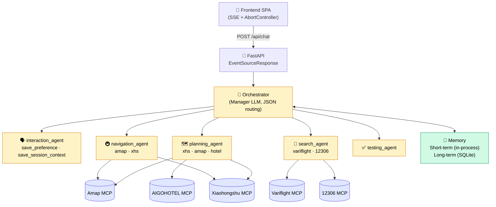

<div align="center">

# 🧳 Multi-Agent Travel Assistant

**A hands-on Multi-Agent orchestration project inspired by Microsoft Agent Framework's Magentic pattern.**

An end-to-end travel assistant built on FastAPI and DeepSeek. A Manager LLM dispatches work to 5 domain agents that collaborate across the full flow: clarify the request → plan the itinerary → re-route on the fly → search tickets → quality-check the reply. Integrates 5 real-world MCP data sources and a two-tier memory system for personalized service.

[English](README_EN.md) | [中文](readme.md)

[](https://www.python.org/)
[](https://fastapi.tiangolo.com/)
[](https://www.deepseek.com/)
[](https://modelcontextprotocol.io/)
[](#-quickstart-docker-recommended)
[](.github/workflows/ci.yml)
[](LICENSE)

</div>

---

## ✨ Highlights

| Area | What it does |
| --- | --- |
| **Multi-agent orchestration** | A Manager LLM emits JSON `next_agent / subtask / final_answer` decisions; 5 domain agents run their own ReAct + tool-calling loops |
| **Real MCP integrations** | Custom `MCPClient` auto-detects **SSE / Streamable HTTP** transports; integrated 5 ecosystem MCP servers (Amap, Xiaohongshu, 12306, Variflight, AIGOHOTEL) with automatic mock fallback |
| **Two-tier memory system** | **Short-term** (in-process session cache, 30-min TTL): stores full message history + session notes; **Long-term** (SQLite-persisted): stores cross-conversation user preferences; both layers injected into Manager and every downstream agent |
| **DeepSeek compatibility** | Patches DeepSeek's occasional DSML-style tool calls (`_parse_dsml_calls`); manager `json_object` is double-wrap tolerant via `_extract_decision` |
| **Streaming + cancellation** | FastAPI + `sse-starlette` pushes `manager / agent_start / agent_end / final` events; the SPA cancels mid-stream via `AbortController`, the backend's orchestrator unwinds cleanly |
| **POI auto-linkification** | Backend `_enrich_poi_locations` fills missing coordinates via Amap geocode; frontend `linkifyPois` wraps shop names into clickable Amap marker URLs |
| **Domain-aware link rendering** | Markdown links classified by host: Xiaohongshu red / Ctrip blue / 12306 green / Amap POI pink; non-whitelisted URLs are stripped to prevent LLM hallucinations |
| **Local-knowledge fallback** | After Amap's official transit answer, the navigation agent is forced to query Xiaohongshu for hidden minibuses / shuttles / shortcuts — the local stuff Amap misses |
| **DEMO_MODE offline** | Single env flag forces every MCP URL empty → all mocks. Recruiters / teammates can clone & demo with zero external keys |

> All bug-fix details (DeepSeek DSML, anyio cancel scope crossover, POI geocode retry, SSE cancellation, two-tier memory) are documented in commit messages and source comments.

---

## 🏗️ Architecture



**Data flow:** user message → browser geolocation auto-fill → load two-tier memory (session notes + long-term preferences) → Manager LLM routes → selected agent runs its tool loop → tool results stream back → Manager re-dispatches if needed → `final` event ships markdown + POI list + user location → frontend renders with host-classified clickable links; messages simultaneously synced to short-term cache.

---

## 🧠 Two-Tier Memory System

| | Short-term | Long-term |
|---|---|---|
| **Storage** | In-process Python dict | SQLite database |
| **Scope** | Single session (30-min idle TTL; cleared on restart) | Cross-conversation, permanent |
| **Contents** | Full message cache (last 20 for Manager) + session notes | User preference list |
| **Write tool** | `save_session_context` (headcount, dates, destination…) | `save_user_preference` (dietary, accommodation…) |
| **Injection** | Manager system prompt + every agent's extra_context | Manager system prompt + every agent's extra_context |

When the short-term cache is empty (after restart), the orchestrator automatically falls back to the last 8 messages from the DB so context is never fully lost.

---

## 🛠️ Tech stack

- **Backend:** Python 3.11, FastAPI, `sse-starlette`, official `mcp` SDK (SSE + Streamable HTTP), `openai` SDK (DeepSeek-compatible), Pydantic v2, async SQLAlchemy
- **LLM:** DeepSeek-Chat (function calling — required for every agent's tool loop)
- **MCPs:** Amap, Xiaohongshu (`xpzouying/xiaohongshu-mcp`), 12306 (`Joooook/12306-mcp`, ModelScope hosted), Variflight (ModelScope hosted), AIGOHOTEL (`yorklu/AI_Go_Hotel_MCP`, ModelScope hosted)
- **Storage:** SQLite (default) / PostgreSQL (production-switchable), async SQLAlchemy
- **Frontend:** single-file SPA (HTML/CSS/JS) with a hand-rolled lightweight markdown renderer and `navigator.geolocation`
- **Deployment:** Docker + docker-compose

---

## 🚀 Quickstart (Docker, recommended)

```powershell
# 1. clone
git clone <your-repo-url> travelagent
cd travelagent

# 2. configure .env (minimum: only OPENAI_API_KEY required)
copy .env.example .env
# edit .env, drop in your DeepSeek key
# want a fully offline tour? set DEMO_MODE=true — all MCPs go mock, no external keys needed

# 3. one-shot up
docker compose up -d --build

# 4. open browser
start http://127.0.0.1:8000
```

**Optional profiles** to also run Xiaohongshu / 12306 MCP locally:

```powershell
docker compose --profile xhs up -d
docker exec -it xhs-mcp /app/login   # scan QR with phone (one-off)

docker compose --profile train up -d
```

---

## 🐍 Quickstart (local Python)

```powershell
conda create -n travelagent python=3.11 -y
conda activate travelagent
pip install -r requirements.txt

copy .env.example .env
# edit .env

python -m uvicorn backend.main:app --host 127.0.0.1 --port 8000
# then open http://127.0.0.1:8000
```

Run the unit tests:

```powershell
pip install -r requirements-dev.txt
pytest tests/ -v
```

---

## 💬 Try it like this

| Scenario | Sample prompt | Agent triggered |
| --- | --- | --- |
| Vague request → clarify | "I want to travel in Chengdu" | interaction |
| Concrete itinerary | "May 17–19, Chengdu, budget ¥3000, off-the-beaten-path" | planning |
| Session note | "There are 3 of us, one is a child" | interaction (short-term memory) |
| Re-route on the fly | After geolocation: "What's good food nearby?" | navigation |
| Local knowledge | "I'm in Huangpu, how do I get to Canton Tower the way locals do?" | navigation + xhs |
| Tickets | "Any high-speed trains from Beijing to Shanghai on May 17?" | search |
| Long-term prefs | "I don't eat coriander" / "I like hotels with pools" | interaction (long-term memory) |
| Mid-stream cancel | After any heavy prompt, click the red **Stop** button | AbortController |

---

## 🔌 Wiring real MCP servers

`MCPClient` picks the transport from the URL: `/sse` → SSE, `/mcp` → Streamable HTTP. Any URL left blank (or any failed call) falls back to the built-in mock — the demo never breaks.

### Amap (recommended, the most useful one)

```env
AMAP_MCP_URL=https://mcp.amap.com/sse?key=YOUR_AMAP_KEY
AMAP_API_KEY=YOUR_AMAP_KEY
```

Apply: <https://lbs.amap.com/api/mcp-server>

### Variflight (flights)

ModelScope-hosted; log in to grab your personal SSE endpoint:

```env
VARIFLIGHT_MCP_URL=https://mcp.api-inference.modelscope.net/<your-token>/sse
```

Page: [ModelScope · Variflight MCP](https://www.modelscope.cn/mcp/servers/@variflight-ai/variflight-mcp)

### 12306

ModelScope-hosted recommended (zero local setup):

```env
TRAIN12306_MCP_URL=https://mcp.api-inference.modelscope.net/<your-token>/sse
```

Page: [ModelScope · @Joooook/12306-mcp](https://www.modelscope.cn/mcp/servers/@Joooook/12306-mcp)

The backend already adapts the `get-tickets` tool, builds real 12306 ticket-page URLs from `from_station_telecode`, and the frontend renders train numbers as green clickable links straight to the official ticket page.

### Xiaohongshu (community)

[`xpzouying/xiaohongshu-mcp`](https://github.com/xpzouying/xiaohongshu-mcp) over Streamable HTTP. Requires QR-code login the first time:

```powershell
docker compose --profile xhs up -d
docker exec -it xhs-mcp /app/login
```

```env
XHS_MCP_URL=http://localhost:18060/mcp
```

### AIGOHOTEL (hotels)

ModelScope-hosted (`yorklu/AI_Go_Hotel_MCP`). Supports real hotel search:

1. Apply for an API Key (with `mcp_` prefix) at <https://mcp.agentichotel.cn/apply>
2. Log in at [ModelScope · AI_Go_Hotel_MCP](https://www.modelscope.cn/mcp/servers/yorklu/AI_Go_Hotel_MCP) to get your personal endpoint, in the form:
   `https://mcp.api-inference.modelscope.net/<your-token>/mcp`

```env
HOTEL_MCP_URL=https://mcp.api-inference.modelscope.net/<your-token>/mcp
```

Leave blank to fall back to the built-in mock automatically.

---

## 📂 Project layout

```
travelagent/
├── backend/
│   ├── agents/                # 5 agents
│   │   ├── base.py            # ReAct loop + DeepSeek DSML compatibility shim
│   │   ├── interaction.py     # Clarification + two-tier memory write
│   │   ├── planning.py
│   │   ├── navigation.py
│   │   ├── search.py
│   │   └── testing.py
│   ├── mcp/                   # 5 MCP clients + mock fallback
│   │   ├── base.py            # MCPClient (short-lived sessions, auto SSE/HTTP)
│   │   ├── amap.py
│   │   ├── xhs.py
│   │   ├── train12306.py
│   │   ├── hotel.py
│   │   └── variflight.py
│   ├── memory/
│   │   ├── memory_store.py    # Long-term memory (async SQLAlchemy, SQLite/PG)
│   │   └── short_term.py      # Short-term memory (in-process cache, 30-min TTL)
│   ├── orchestrator.py        # Manager-LLM orchestration + memory dispatch
│   ├── config.py
│   └── main.py                # FastAPI entry
├── frontend/
│   └── index.html             # single-file SPA (markdown render, SSE, geolocate, cancel)
├── tests/                     # pytest unit tests
├── data/                      # runtime database (memory.db)
├── Dockerfile
├── docker-compose.yml
├── requirements.txt
└── .env.example
```

---

## 📝 Resume blurb (paste-ready)

> **Multi-Agent Travel Assistant** — Python · FastAPI · DeepSeek · MCP (personal project)
> - Designed a Manager-Workers orchestration: a Manager LLM emits JSON routing decisions to 5 domain agents (clarification / planning / navigation / search / QA), each running an independent ReAct tool-calling loop, inspired by Microsoft Agent Framework's Magentic pattern.
> - Built a unified MCP client with automatic SSE / Streamable HTTP transport selection; integrated 5 real-time data sources (Amap, Xiaohongshu, 12306, Variflight, AIGOHOTEL) with automatic mock fallback so the demo never breaks.
> - Designed a two-tier memory architecture — short-term (in-process session cache with 30-min TTL, injecting session notes into all agents) and long-term (SQLite-persisted user preferences), with automatic DB fallback on server restart.
> - Patched DeepSeek's DSML-style tool_call output; refactored `ClientSession` into short-lived connections to fix an anyio cancel-scope crossover bug hanging SSE streams; delivered streaming via FastAPI + sse-starlette with mid-stream `AbortController` cancellation.

---

## 🩺 Troubleshooting

**`docker compose build` fails to pull** — Docker Hub is flaky from CN networks. Configure mirrors in Docker Desktop → Settings → Docker Engine:

```json
{
  "registry-mirrors": [
    "https://docker.m.daocloud.io",
    "https://dockerproxy.net",
    "https://hub-mirror.c.163.com"
  ]
}
```

**`/api/healthz` shows all `mcp` as `false`** — `.env` not picked up. Local Python uses `python-dotenv` automatically; with Docker make sure you use `docker compose up` (compose injects `.env` into the container).

**Long pauses with no reply** — check the backend log for `[MCP:xxx] call_tool failed`. The usual suspects are a wrong Amap key or an expired ModelScope token; clear that URL to force the mock and the chat keeps working.

**Short-term memory gone after restart** — this is by design. Short-term memory is in-process only; after a restart, the orchestrator automatically falls back to reading the last 8 messages from the DB as context.

---

## 🚧 Known simplifications (roadmap)

- Streaming is at agent granularity; tokens inside one agent reply are not streamed
- The testing agent only does single-pass PASS/WARN, no auto-retry
- No OAuth; user IDs are hardcoded by the frontend, used only for preference persistence demo
- Hotel results depend on AIGOHOTEL MCP availability; falls back to mock when the token is not configured
- Session notes are written only by the interaction agent; other agents don't auto-extract context yet

## 📄 License

MIT
